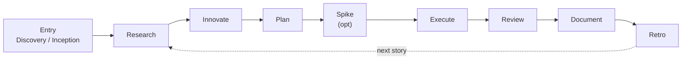

<p align="center">
  
</p>

# 🕷️ SPIDER

**A gate-enforced, spec-first, TDD-mandatory development framework for AI coding agents.**

SPIDER gives an AI coding harness a *predictable process* — the same phases, in the same order,
gated the same way, every run. It doesn't prescribe a fixed *output*; it prescribes the *discipline*
that turns a stochastic agent into a reliable engineer.

> **Status:** framework definition + 13 skills + scaffold templates. Docs site under `docs/`.

---

## Why SPIDER?

Every AI coding agent eventually hits the same failure modes: it skips the thinking, drifts from the
spec, writes code before tests, and declares "done" on faith. SPIDER exists to wring determinism out
of that stochastic system. **Predictability** — the agent taking the same *process* every run — is
the root virtue; every gate, hook, and rule below serves it.

## The name

**SPIDER** is the brand name. The letters stand for the framework's **capabilities** — they name
*what* it can do, **not the phase order**:

| Letter | Capability | |
|--------|-----------|-|
| **S** | Spike / PoC | optional risk-reduction |
| **P** | Plan | spec + test plan, gate-enforced |
| **I** | Innovate · Inception | greenfield bootstrap + solution exploration |
| **D** | Documentation · Discovery | brownfield analysis + records + postmortems |
| **E** | Execute | TDD implementation (Red → Green → Refactor) |
| **R** | Research · Review | external research + spec validation |

Phases are therefore always referenced by **full name** ("the Research phase"), never by letter. The
*spider* metaphor fits too: the agent sits at the center of a **web** of specs, skills, gates, and
hooks — and like a web, the framework is built to **catch problems early**.

## Core philosophy

1. **Thinking precedes writing.** Each phase feeds the next; order is unbreakable.
2. **Spec is above code.** Code changes follow spec changes; spec changes need approval.
3. **TDD is mandatory** — tests before implementation is a protocol rule, not a suggestion.
4. **Every deviation is recorded.** Drift is never silent.
5. **Gates are passed, not skipped.**
6. **Simplicity always wins.**
7. **Retro always happens.**

## The flow



**Entry** runs once (greenfield → Inception, brownfield → Discovery). The **cycle** repeats per
story. Full gate-enforced diagram and loops in [The Flow](docs/flow.md).

## The 13 skills

Every SPIDER phase is a real skill (trigger + step discipline + output schema), under `skills/`:

| Skill | Type | Purpose |
|-------|------|---------|
| `spider-init` | user | Bootstrap `.spider/` + `specs/`, install skills, wire the git hook |
| `spider-router` | model | Decide which phase runs next, from `specs/` state |
| `spider-discovery` | user | Brownfield entry — map an existing codebase |
| `spider-inception` | user | Greenfield entry — elicit decisions, stack, environment |
| `spider-research` | user | External research — best practices & library docs |
| `spider-innovate` | user | Explore the solution space; ≥2 scored alternatives |
| `spider-plan` | user | Approvable `feature.spec.md` + `TEST-PLAN.md` |
| `spider-spike` | model | Time-boxed PoC for an unknown |
| `spider-execute` | model | TDD, one vertical slice at a time |
| `spider-debug` | model | Root-cause loop on repeated Quality-Gate failure |
| `spider-review` | model | Validate implementation against the spec |
| `spider-document` | model | Capture every session output |
| `spider-retro` | user | Digest sessions, promote decisions, clean up |

**user-invoked** = you trigger it (orchestration, zero context load). **model-invoked** = the agent
fires it when its trigger matches (carries the discipline). Full table in [Skills](docs/skills.md).

## Get started

**1. Install** the skills once per machine (asks harness + scope):

```bash
curl -fsSL https://raw.githubusercontent.com/netologist/spider/main/install.sh | bash
```

**2. Init** each project — scaffolds `.spider/` (hooks + configs) and `specs/`, wires the git hook:

```text
/spider-init
```

See [Installation](docs/installation.md) and [Getting Started](docs/getting-started.md).

## Repository layout

```
spider/
├── README.md                 ← you are here
├── install.sh                ← one-command installer (curl | bash)
├── mkdocs.yml                ← docs site config (Material + mermaid)
├── docs/                     ← the documentation site
│   └── assets/               ← images, logo
├── skills/                   ← the 13 SPIDER skills
│   ├── spider-init/
│   │   └── templates/        ← scaffold: hooks, harness.yaml, config.json, spec seeds
│   ├── spider-router/
│   ├── spider-discovery/ … spider-retro/
└── requirements-docs.txt     ← MkDocs build dependencies
```

## Documentation

The full methodology lives in the `docs/` site (run `mkdocs serve` locally, or it'll be published via
GitHub Actions):

- [Overview](docs/overview.md) · [The Flow](docs/flow.md) · [Directory Structure](docs/structure.md)
- [Getting Started](docs/getting-started.md) · [Installation](docs/installation.md)
- [Phases](docs/phases/index.md) · [Skills](docs/skills.md) · [Components](docs/components.md)
- [Record Files](docs/records.md) · [Configuration](docs/configuration.md) · [Rules](docs/rules.md)
- [Integrations](docs/integrations.md) · [Comparison](docs/comparison.md)

## Status & roadmap

- [x] Framework definition (merged into `docs/`)
- [x] 13 phase skills + `spider-init` scaffold templates + 6 hook scripts
- [x] Installer (`install.sh`) + Installation docs
- [x] MkDocs publish pipeline (GitHub Actions)
- [x] Subagent definitions (6 agents under `.spider/agents/`)

## License

MIT © 2026 Hasan Ozgan — see [LICENSE](LICENSE)
