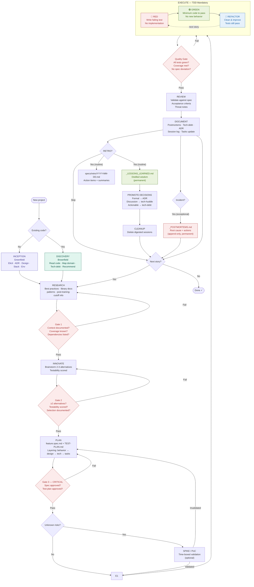

# The Flow

SPIDER runs one fixed flow. Entry happens once per project; the cycle repeats per story until the
project is done. Every transition through a red node is a **gate** — passed, never skipped.

## Loops within the flow

| Loop | Scope | Limit |
|------|-------|-------|
| **Main flow** | Discovery/Inception → … → Retro → next story | Unlimited (until the project ends) |
| **TDD micro-loop** | Red → Green → Refactor, **vertical-slice** | Until the story completes |
| **Grilling loop** | Inception elicitation + Innovate alternatives | Until every branch of the decision tree is resolved |
| **Gate-retry loop** | When any gate fails | `max_gate_retries: 3` — see [Components](components.md#gates) |
| **Debugging loop** | When the Quality Gate fails on an unexpected bug | reproduce → minimise → hypothesise → instrument → fix → regression-test |
| **Retro loop** | Periodic | Every epic close, or at least every 2 weeks |

## Entry vs cycle

**Entry** (Discovery or Inception) runs **once**, at project start — it fills the `specs/context/`
files everything else reads. The **cycle** (Research → … → Retro) repeats per story.
