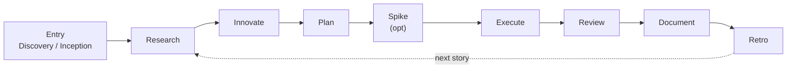

<p align="center">
  
</p>

# SPIDER

> A **gate-enforced, spec-first, TDD-mandatory** development framework for AI coding agents.

SPIDER gives an AI coding harness a predictable **process** — the same phases, in the same order,
gated the same way, every run. It does not prescribe a fixed *output*; it prescribes the *discipline*
that turns a stochastic agent into a reliable engineer.

## At a glance

- **Spec is above code.** Code changes follow spec changes; spec changes need human approval.
- **TDD is mandatory.** Tests before implementation, one vertical slice at a time.
- **Every deviation is recorded.** Drift is never silent — it is logged and actioned.
- **Gates are passed, not skipped.** No phase progresses without its gate.

## The flow



See [The Flow](flow.md) for the full gate-enforced diagram.

## Where to start

- New to SPIDER? Read the [Overview](overview.md).
- Setting up a project? Follow [Getting Started](getting-started.md) (`spider-init`).
- Want the full methodology? Start with [Phases](phases/index.md).

## In this repository

```
spider/
├── README.md                 ← this landing page
├── install.sh                ← one-command installer (curl | bash)
├── mkdocs.yml                ← MkDocs site config
├── docs/                     ← this documentation site
│   └── assets/               ← images, logo
├── skills/                   ← the 13 SPIDER skills (init + router + 11 phases)
│   └── spider-init/templates/ ← scaffold templates (hooks, configs, spec seeds)
└── requirements-docs.txt     ← MkDocs build dependencies
```
