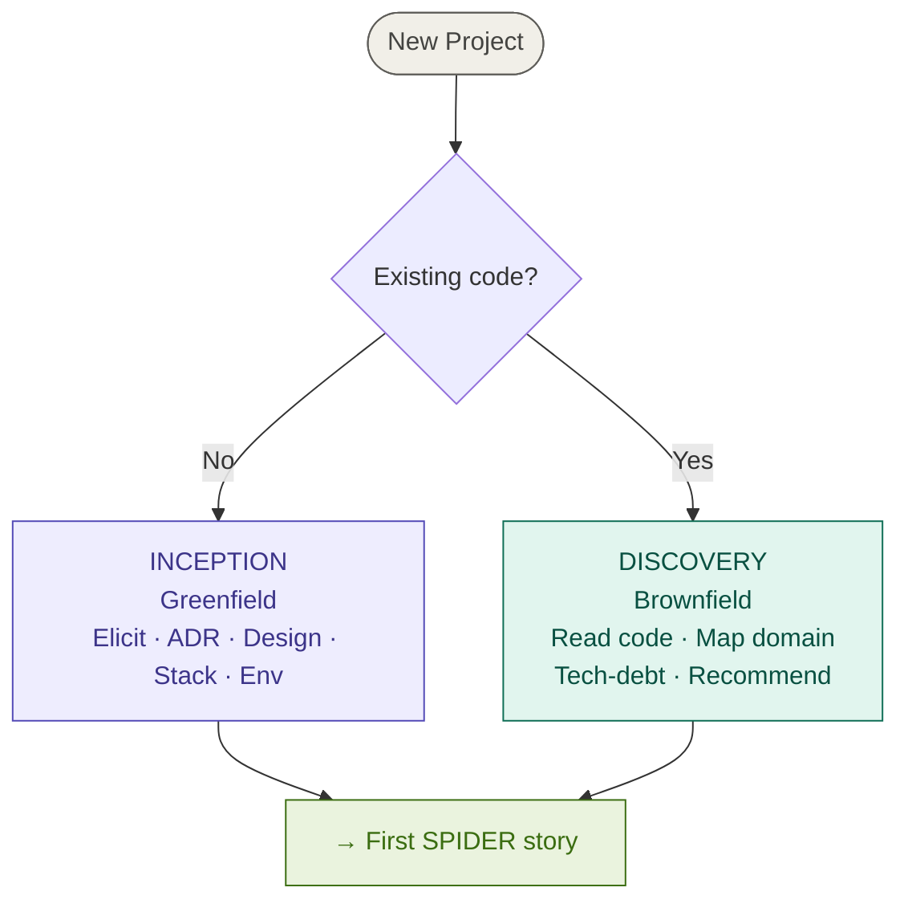
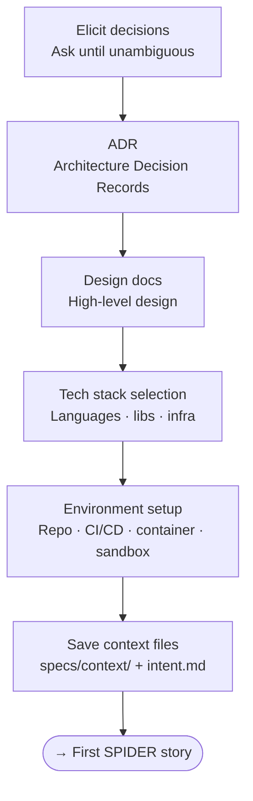
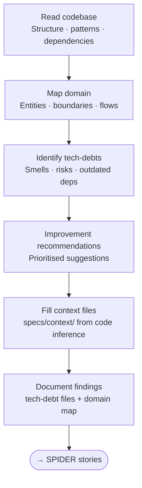

# Project Entry Gate, Inception & Discovery
>
> One-time project bootstrap: route to Inception (greenfield) or Discovery (brownfield).

## Project Entry Gate

**When this runs:** Run **once** at the start of a project. Never re-run unless restarting from scratch.

| Condition | Flow |
|---|---|
| No existing codebase | [INCEPTION](#inception--greenfield) |
| Existing codebase | [DISCOVERY](#discovery--brownfield) |

---

## Inception — Greenfield

**When this runs:** No existing codebase (greenfield), routed from the Entry Gate.

**Purpose:** Establish all decisions, architecture, tech stack, and environment from scratch. The harness must ask — never assume — until everything is unambiguous.

**Steps**

1. **Elicit decisions** — Ask all open questions; never assume.
2. **ADR** — For every significant decision: `specs/architecture/adr-<NNN>-<slug>.md`. Update `specs/architecture/README.md` index.
3. **Design docs** — `specs/design/system-overview.md`, `specs/design/nfr.md`
4. **Tech stack** — `specs/design/tech-stack.md`
5. **Environment setup** — Repo, CI/CD, isolated harness, README.md
6. **Save context** — `specs/context/` files filled from user input + `specs/sessions/<date>/intent.md`

**Outputs**

| Artifact | Location |
|---|---|
| Architecture decisions | `specs/architecture/adr-*.md` |
| ADR index | `specs/architecture/README.md` |
| System design | `specs/design/system-overview.md` |
| NFR/CFR/XFR requirements | `specs/design/nfr.md` |
| Tech stack | `specs/design/tech-stack.md` |
| Context files | `specs/context/PROJECT.md, STACK.md, CONVENTIONS.md, GLOSSARY.md` |
| First story intent | `specs/sessions/<date>/intent.md` |
| Bootstrapped environment | repo + CI/CD + container |

**Exit gate:** None — proceeds directly to the first SPIDER story (Research phase).

**Constraints:** The harness must ask — never assume — until everything is unambiguous. No code writing.

Operational discipline: see the `spider-inception` skill.

---

## Discovery — Brownfield

**When this runs:** Existing codebase (brownfield), routed from the Entry Gate.

**Purpose:** Understand an existing codebase before proposing or executing any changes. Produces the **same `specs/context/` files** as Inception, but infers them from existing code and configuration rather than asking the user. Unclear items are marked `[NEEDS CLARIFICATION]`.

**Steps**

1. **Read codebase** — Structure, entry points, dependencies, test coverage, build scripts
2. **Map domain** — Entities, boundaries, data flows, external integrations → `specs/architecture/as-is.md`
3. **Identify tech-debts** — For each: `specs/tech-debts/<slug>.md`
4. **Improvement recommendations** — Ranked: security > correctness > performance > maintainability
5. **Fill context files** — `specs/context/PROJECT.md, STACK.md, CONVENTIONS.md, GLOSSARY.md`
   inferred from codebase; gaps marked `[NEEDS CLARIFICATION]`
6. **Document findings** — Session context to `specs/sessions/<date>/context.md`

**Outputs**

| Artifact | Location |
|---|---|
| As-is architecture | `specs/architecture/as-is.md` |
| Tech debt items | `specs/tech-debts/*.md` |
| Context files (inferred) | `specs/context/PROJECT.md, STACK.md, CONVENTIONS.md, GLOSSARY.md` |
| Improvement backlog | `specs/sessions/<date>/context.md` |
| Domain map | `specs/architecture/as-is.md` |

**Exit gate:** None — proceeds directly to the first SPIDER stories (Research phase).

**Constraints:** No code writing. Context is inferred from the existing codebase; unclear items marked `[NEEDS CLARIFICATION]`.

Operational discipline: see the `spider-discovery` skill.
