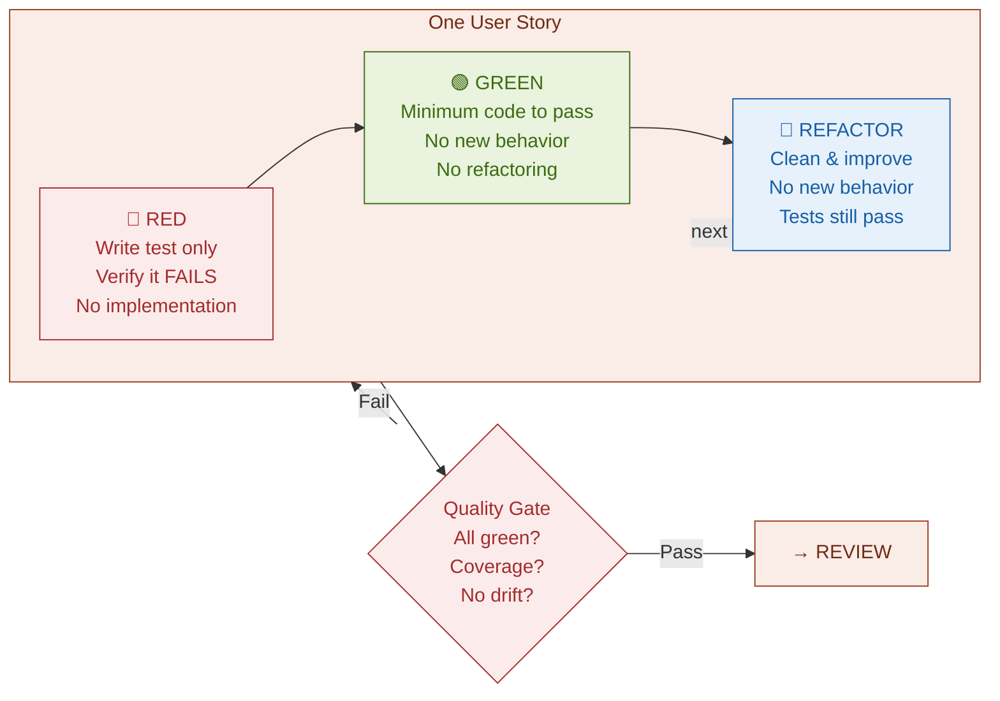

# Execute (TDD Mandatory)
>
> Implement user stories with strict TDD discipline.

**When this runs:** After Plan passes Gate 3 (and after any Spike is validated); before Review.

Execute uses three internal prompts (Red → Green → Refactor) enforced by the AI harness. These are **not separate workflow phases** — they are implementation discipline within Execute.

**Sub-steps:**

| Sub-step | Rule | Constraint |
|----------|------|------------|
| **Red** | Write test only, verify it fails | No implementation code. No touching non-test files. |
| **Green** | Minimum code to pass tests | No new behavior beyond spec. No refactoring. |
| **Refactor** | Clean up, improve readability | No new behavior. Spec unchanged. Tests must still pass. |

**Vertical-slice / tracer-bullet discipline (mandatory):**
The `tdd` skill explicitly bans the **"horizontal slicing" anti-pattern** — writing all tests first, then all implementation, for a story. Within a story, work **one test → one implementation → repeat** (the tracer-bullet / vertical-slice discipline). Each user story completes the full Red → Green → Refactor cycle before moving to the next story.

**Exit gate — Quality Gate (Execute → Review, machine-passed):**

- [ ] All tests green
- [ ] Coverage target met
- [ ] No type/lint errors
- [ ] No deviation from `feature.spec.md`
- [ ] DRIFT.md empty or all drifts acknowledged

**Execution modes — asked at Execute start:**
> "This feature has N user stories. Execute inline (sequential, default) or via subagents with git worktrees (parallel, isolated commits)?"

| Mode | Behavior |
|------|----------|
| **Inline** (default) | All stories run in current session, sequential TDD per story |
| **Subagent + Worktree** | Each story → separate subagent in isolated git worktree; parallel execution; results merged; full test suite on merge; Review phase on merged result |

**Constraints:** No new behavior beyond `feature.spec.md`. No refactoring during Green. Tests must still pass after Refactor.

Operational discipline: see the `spider-execute` skill.
