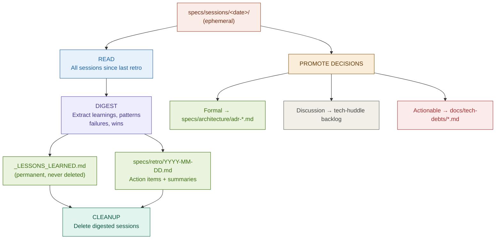

# Retro *(run periodically)*
>
> Digest completed sessions into actionable learnings, promote decisions, clean up.

**When this runs:** After every epic completion, or at minimum every 2 weeks. Also the terminal phase of the per-story cycle.

**Promote decisions:** Formal architectural → `specs/architecture/adr-*.md`; items needing team discussion → tech-huddle backlog; actionable improvements → `docs/tech-debts/*.md`.

**Outputs:**

- `specs/sessions/_LESSONS_LEARNED.md` (permanent, never deleted)
- `specs/retro/YYYY-MM-DD.md` (action items + summaries)
- Promoted ADRs / tech-huddle / tech-debt items
- Deleted session directories (cleanup)

**Why sessions are deleted after retro:**

- Git log captures WHAT changed (commits, diffs)
- Memory Graph / graphify captures entity relationships and architectural patterns
- ADRs capture WHY decisions were made
- Retro reports capture learnings and action items
- Detailed session logs are scaffolding — once graph + ADR + retro artifacts exist, they're redundant

**Constraints:** "Archive, not summarize" — before a session is deleted, rejected alternatives, ordering decisions, and fine constraints must be carried into `_LESSONS_LEARNED.md`. This step is done by the `retro-digest-agent` in a context **separate** from the one that wrote the sessions, with human approval before deletion.

Operational discipline: see the `spider-retro` skill.
