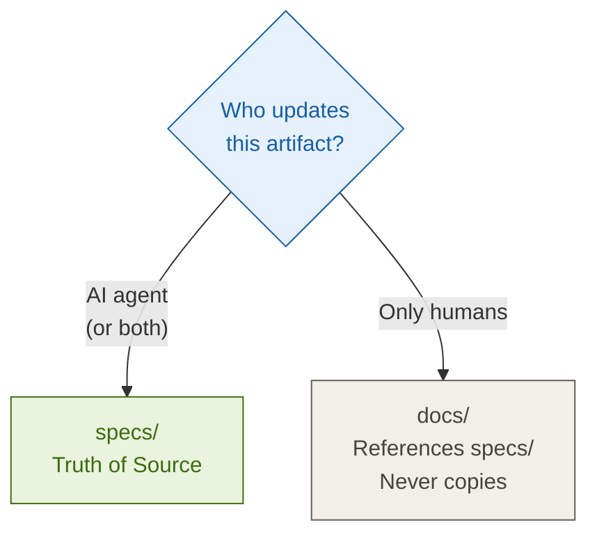
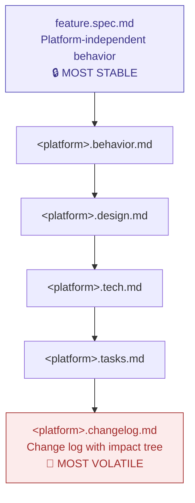

# Rules

The non-negotiables. Every SPIDER skill enforces these.

1. **Postmortems** — Any rollback, failed approach, or lesson learned → `specs/postmortems/<slug>.md`.
2. **Incident postmortems** — Production incidents, outages, data loss → `specs/sessions/_POSTMORTEMS.md` (append-only, permanent, never deleted).
3. **Tech debts** — Any improvement opportunity → `specs/tech-debts/<slug>.md`.
4. **Session log** — At session end, save all changed files + summary → `specs/sessions/<date>/session.md`.
5. **Retro** — Routine at every feature/sprint close: digest sessions → `_LESSONS_LEARNED.md`; delete digested session directories.
6. **Tasks** — When a story starts, sub-tasks → `specs/sessions/<date>/tasks.md`; update on completion.
7. **Intent** — When a story starts, save `specs/sessions/<date>/intent.md` before any execution.
8. **Never assume** — When context is missing or ambiguous, ask. Do not invent facts.
9. **Consult history** — Before starting: `_LESSONS_LEARNED.md`, `_POSTMORTEMS.md`, the ADR index, `specs/design/`, `specs/context/`, `specs/logs/`.
10. **Language** — Converse in the user's language. All output documents in English.
11. **Folder scope** — Work only in the current project folder or `/tmp`. Never access parent folders.
12. **ADR on every design decision** — Any significant architecture/design decision → `specs/architecture/adr-<NNN>-<slug>.md` + update the index.
13. **Threat notes** — Security-sensitive changes include a short threat note in the session file.
14. **README is for humans, AGENTS.md is for AI** — Both exist at project root. No overlap.
15. **Separate `specs/` and `docs/` by ownership of truth** — If AI can create or update the content, it belongs in `specs/`; `docs/` is human-maintained and may only reference `specs/`, never duplicate it.
16. **Feature file layering** — Every feature has layers in descending stability: `feature.spec.md` → `<platform>.behavior.md` → `<platform>.design.md` → `<platform>.tech.md` → `<platform>.tasks.md` → `<platform>.changelog.md`.
17. **Think before code** — Brainstorm and plan first. Do not jump to implementation until the design is clear and agreed upon.
18. **Verification before assertion** — Never claim something "works" without running the verification command and showing the evidence.
19. **Postmortem is not blame** — Incident records document how the system failed so it doesn't happen again.
20. **Commit discipline** — Use `feat:`, `fix:`, `refactor:`, `test:`, `docs:` prefixes. Never commit secrets or kubeconfig files.

## Truth of source — decision flow

## Feature file layering — stability hierarchy

