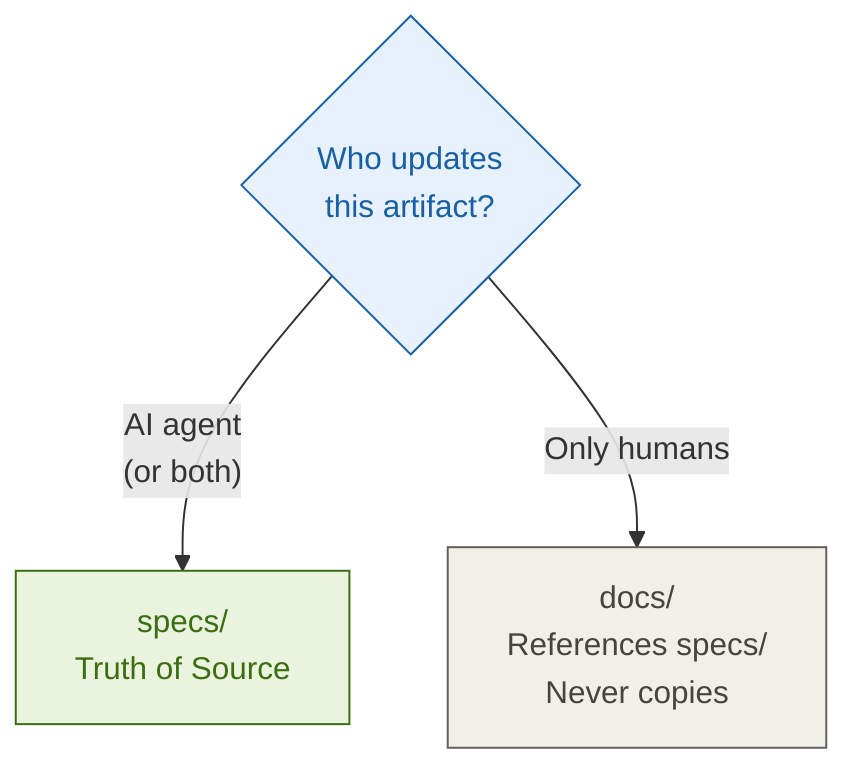
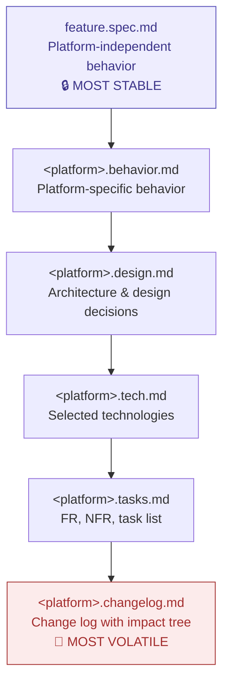
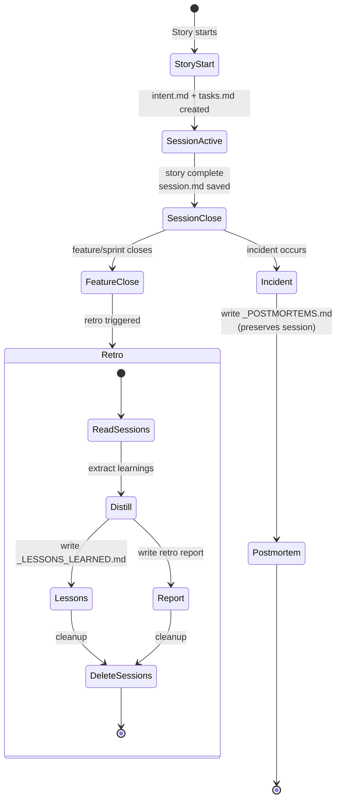

# Directory Structure

SPIDER splits a project by **ownership of truth**. Four zones, each with one owner:

- `.spider/` — **harness infrastructure** (prompts, gates, hooks, config). Hidden.
- `specs/` — **AI-managed**, the single source of truth for anything AI can create or update.
- `docs/` — **human-maintained**; references `specs/`, never duplicates it.
- `README.md` (humans) and `AGENTS.md` (AI) at the root — no overlap between them.

```
project/
├── README.md                         ← Humans only
├── AGENTS.md                         ← AI only (harness-agnostic)
│
├── .spider/                          ← Harness infrastructure (hidden)
│   ├── harness.yaml                  # MCPs, skills, agents, model matrix
│   ├── rules.md                      # Custom AI rules
│   ├── config.json                   # Internal framework config
│   ├── gates/                        # Gate checklists
│   └── hooks/                        # Automation scripts
│
├── specs/                            ← AI-managed — truth of source
│   ├── context/                      # Filled by Inception & Discovery
│   │   ├── PROJECT.md
│   │   ├── STACK.md
│   │   ├── CONVENTIONS.md
│   │   └── GLOSSARY.md
│   ├── inception/README.md
│   ├── features/
│   │   ├── _template/
│   │   │   ├── feature.spec.md       # Platform-independent behavior
│   │   │   ├── <platform>.behavior.md
│   │   │   ├── <platform>.design.md
│   │   │   ├── <platform>.tech.md
│   │   │   ├── <platform>.tasks.md
│   │   │   ├── <platform>.changelog.md
│   │   │   ├── TEST-PLAN.md
│   │   │   ├── DECISIONS.md
│   │   │   └── feature.feature       # Gherkin BDD
│   │   └── auth/                     # Example feature
│   ├── architecture/
│   │   ├── README.md                 # ADR index
│   │   ├── as-is.md                  # Discovery: current state
│   │   ├── adr-001-*.md
│   │   ├── data-models.md
│   │   └── api-contracts.md
│   ├── design/
│   │   ├── system-overview.md
│   │   ├── nfr.md
│   │   └── tech-stack.md
│   ├── retro/2026-06-09.md
│   ├── postmortems/auth-service-outage.md
│   ├── tech-debts/add-load-testing.md
│   ├── logs/
│   │   ├── DECISIONS.md
│   │   ├── DRIFT.md
│   │   ├── ARCH_LOG.md
│   │   ├── DESIGN_LOG.md
│   │   └── INTENT_CHANGES.md
│   └── sessions/                     ← Ephemeral — deleted after retro
│       ├── _LESSONS_LEARNED.md       # Permanent, distilled from retros
│       ├── _POSTMORTEMS.md           # Permanent, incident timeline (append-only)
│       └── 2026-06-09-auth-login/
│           ├── intent.md
│           ├── tasks.md
│           └── session.md
│
├── docs/                             ← Human-maintained — references specs/
│   ├── onboarding.md
│   ├── contributing.md
│   └── product-roadmap.md
```

## Truth-of-source decision



In practice:

- `specs/features/*` — AI writes and updates
- `specs/logs/*`, `specs/architecture/*` — AI writes, humans read → stays in `specs/`
- `docs/onboarding.md`, `docs/contributing.md`, `docs/product-roadmap.md` — only humans write/read

## Feature file layering

Every feature has layers in **descending order of stability**:



## Session lifecycle

Sessions are raw, date-stamped directories — temporary scaffolding. Two permanent artifacts
survive: `_LESSONS_LEARNED.md` (from retros) and `_POSTMORTEMS.md` (from incidents).



### Retro vs Postmortem

| | Retro | Postmortem |
|---|---|---|
| **When** | Routine — every feature/sprint close | Exceptional — when something breaks |
| **Question** | "What did we learn, let's move forward." | "Why did it happen, never again." |
| **Learns from** | Success | Failure |
| **Output** | `_LESSONS_LEARNED.md` (distilled) | `_POSTMORTEMS.md` (append-only) |
| **Deletes sessions?** | Yes | No (preserves the incident session) |

**Why sessions are deleted after retro:** Git log captures *what* changed; the knowledge graph +
ADRs capture *why*; `_LESSONS_LEARNED.md` captures distilled wisdom. Once those exist, detailed
session logs are redundant scaffolding.
